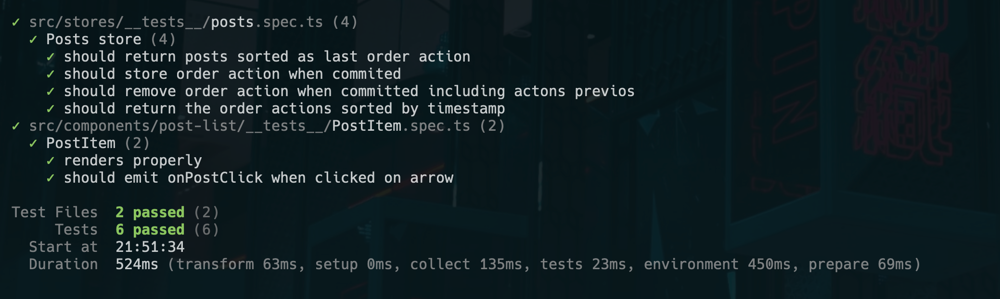

# temper

## Installation
To run this project locally, follow these steps:

- Clone the repository to your local machine.
- Navigate to the project directory.
- Install dependencies by running `yarn`.
- Start the development server with `yarn dev`.
- Open your browser and go to `http://localhost:5173` (or the appropriate address shown in the terminal).

## Testing
To run the tests, use the following command:

```yarn test:unit```

### Test Coverage
I prefer to keep logic out of the components and instead use the store to manage the state and logic.
For demo purposes I tested only critical on my opinion parts of the app.
However, in a real-world scenario, I would write more tests to cover a bit more and ensure the app is working as expected.



## Usage
Once the project is set up, you can explore the app and interact with its features.

## Additional Notes
This project was built using typescript, vue 3, pinia, and tailwindcss.

Feel free to reach out if you have any questions or need further clarification. I'd be glad to answer any follow-up questions you may have!
